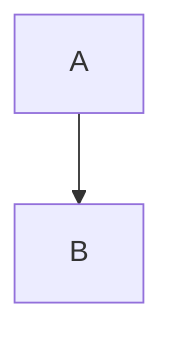

# rehype-mermaid-lite

A lightweight rehype plugin that transforms mermaid code blocks into:

```html
<pre class="mermaid">...</pre>
```

Designed for client-side Mermaid rendering.

## Installation

```bash
npm install rehype-mermaid-lite
```

## Usage

### With Astro

```ts
import rehypeMermaidLite from "rehype-mermaid-lite"

export default defineConfig({
  markdown: {
    syntaxHighlight: {
      excludeLangs: ["mermaid"],
    },
    rehypePlugins: [rehypeMermaidLite],
  },
})
```

### With unified

```ts
import { unified } from "unified"
import remarkParse from "remark-parse"
import remarkRehype from "remark-rehype"
import rehypeStringify from "rehype-stringify"
import rehypeMermaidLite from "rehype-mermaid-lite"

const processor = unified()
  .use(remarkParse)
  .use(remarkRehype)
  .use(rehypeMermaidLite)
  .use(rehypeStringify)
```

## Client-side Mermaid Setup

After HTML is generated, load Mermaid in the browser:

```ts
import mermaid from "mermaid"

mermaid.initialize({ startOnLoad: false })
await mermaid.run()
```

Or via CDN:

```html
<script type="module">
  import mermaid from "https://cdn.jsdelivr.net/npm/mermaid@11/dist/mermaid.esm.min.mjs"
  mermaid.initialize({ startOnLoad: false })
  await mermaid.run()
</script>
```

## Example

Markdown:

````md

````

will be transformed into:

```html
<pre class="mermaid">
  graph TD
  A --> B
</pre>
```

## License

MIT License

Copyright (c) 2026 Chiahong Hong
